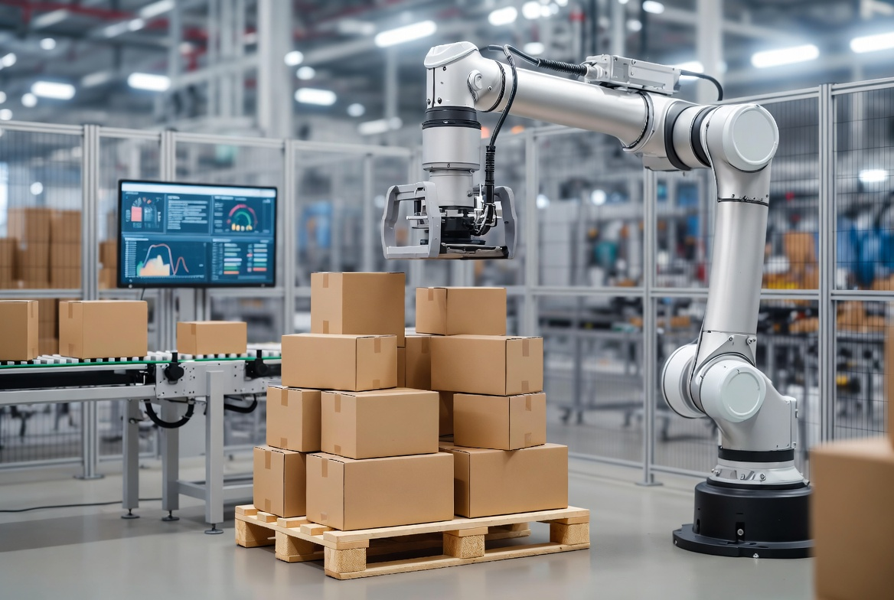
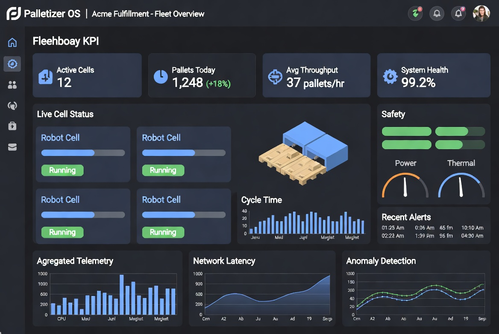
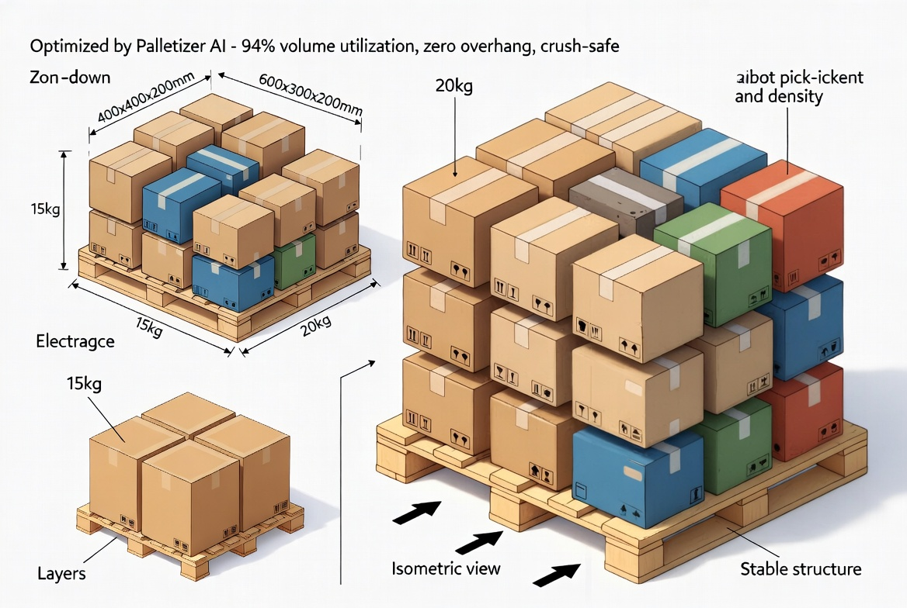
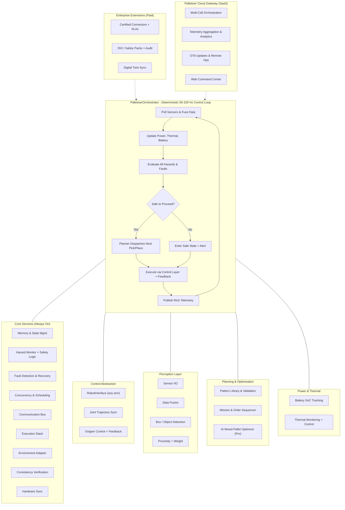

# Palletizer OS

**The Open-Source Foundation + Enterprise SaaS Platform for Intelligent, High-Throughput Palletizing Cells**

*One codebase. Any robot arm. Any gripper. Any factory. Deploy in hours. Scale to global fleets. Capture massive ROI.*

> **Live site and interactive optimizer -> [palletizer-app.vercel.app](https://palletizer-app.vercel.app)**

[](https://www.python.org/downloads/)
[](LICENSE)
[](https://github.com/psf/black)
[](https://github.com/iceccarelli/palletizer/actions/workflows/ci.yml)
[](https://palletizer-app.vercel.app)
[](https://github.com/iceccarelli/palletizer)
[](https://discord.gg/palletizer)

---



*Production palletizing cell powered by Palletizer OS. Hardware-agnostic. Safety-first. Ready for mixed-SKU intelligence.*

---

## The Billion-Dollar Opportunity We're Seizing

Palletizing sits at the critical junction of manufacturing and logistics. It accounts for a huge share of industrial robot deployments worldwide, yet most factories and warehouses still do it manually or with brittle, custom-coded systems.

**Market Reality (2025-2026 forecasts):**
- Palletizing robots / robotic palletizers market valued in the **$2–5+ billion** range and expanding at **5–10%+ CAGR**, with some segments and broader warehouse robotics hitting **17%+ CAGR** (reaching $24B+ by 2031).
- Warehouse automation overall exploding due to e-commerce SKU proliferation, same-day delivery pressure, labor shortages, and reshoring.
- **Manual palletizing pain is expensive**: High repetitive-strain injuries (major workers' comp driver), throughput capped at ~15–25 pallets per person-hour, chronic recruiting/turnover issues, inconsistent stacks causing product damage and unstable loads in transit.

**Automated ROI is proven**: Most deployments pay back in **12–24 months** through 30–60%+ labor cost reduction, 50–100%+ throughput gains, 24/7 operation, near-elimination of stacking errors, and dramatically lower injury rates. The companies that move fastest win.

**The #1 hidden bottleneck (and highest-margin opportunity)**: Software.

Every integrator and OEM rebuilds the same control loops, safety logic, planning algorithms, sensor fusion, telemetry, and integration glue from scratch. Result? Long deployment cycles (weeks to months), high project risk/cost, vendor lock-in, and painful maintenance when SKUs change or hardware evolves. High-mix / mixed-case palletizing (the future of e-comm and flexible manufacturing) is especially brutal without smart software.

**Palletizer OS exists to kill that friction forever.**

We deliver a **modular, deterministic, hardware-agnostic, safety-certified-ready software foundation** that lets teams go from "idea" to "running production cell" in hours/days instead of weeks/months. Then we layer on the enterprise SaaS, AI optimization, certified connectors, compliance tooling, and fleet orchestration that serious operators will happily pay premium recurring revenue for.

This is how an open-source project becomes the category king — and a high-margin, defensible, recurring-revenue business serving exactly the manufacturers, 3PLs, integrators, and OEMs who have the cash and the mandate to invest in automation that actually delivers ROI.

---

## The Problem We Ruthlessly Solve

Traditional approaches fail at scale:

- **Custom code hell** — Every cell is a snowflake. Safety, fault handling, trajectory planning, gripper logic, and WMS integration rewritten repeatedly.
- **Integration tax** — $50k–$500k+ per cell in services before you even run one pallet. Long sales-to-go-live cycles kill ROI.
- **Inflexibility** — Proprietary stacks or simple rule-based systems choke on mixed SKUs, variable box sizes/weights, or new product introductions.
- **Visibility & control gaps** — No unified way to monitor, optimize, or update dozens/hundreds of cells across plants.
- **Certification & liability friction** — Safety validation and audit trails are painful without a designed-for-purpose foundation.
- **Talent & maintenance burden** — Hard to find/retain people who understand the full stack you just built.

**Result**: Many companies delay automation or accept mediocre ROI. Integrators stay small because every project is bespoke and risky.

Palletizer OS flips the script.

---

## The Solution: Palletizer Full Stack + Enterprise Platform

**One integrated, extensible system** designed from day one for real factories:

### Open Core (Apache 2.0 — Free Forever)
The reliable engine you can inspect, modify, deploy, and trust.

- **PalletiserOrchestrator** — Hard real-time deterministic control loop (default 50 Hz, configurable). Poll sensors → update power/thermal → evaluate hazards → execute tasks → publish telemetry. Always safe.
- **Core Services** — Memory, concurrency, fault detection, hazard monitoring, communication, execution stack, environment adaptation, hardware sync, consistency verification.
- **Control Layer** — Abstract `RobotInterface` + `Gripper` + joint sync. Retry logic, pressure/force feedback. Works with any arm.
- **Perception** — Sensor I/O + fusion foundation. Box detection, proximity, weight. Ready for depth cameras and advanced CV.
- **Planning** — Pattern management + mission sequencing. Extensible for your rules or our upcoming AI optimizer.
- **Power Management** — Battery SoC tracking, thermal monitoring with hysteresis, energy-aware behaviors.
- **Examples & Sim** — Run instantly with dummy robot. Perfect for CI, training, and rapid prototyping.

**Integrate any hardware in <100 lines of code.** Pass your `RobotInterface` implementation — the rest of the stack is unchanged. Same for grippers and sensors.

### Commercial Layers (Where Paying Customers Win Big)
- **Certified Robot & Gripper Connectors** (Pro/Enterprise) — Validated performance, safety margins, and SLAs for UR, Fanuc, ABB, KUKA, Yaskawa, and more. Plus vacuum/mechanical gripper profiles with pressure feedback.
- **AI-Powered Mixed Pallet Optimization** (Roadmap flagship) — Automatically generate stable, high-density, crush-safe, weight-balanced patterns for mixed SKUs. Upload your box database + photos → production-ready program. 90%+ volume utilization common.
- **Palletizer Cloud Gateway (SaaS)** — The fleet operating system. Real-time multi-cell monitoring, telemetry aggregation, OTA updates, remote diagnostics, digital twin sync, role-based access, audit logs. Per-cell monthly subscription. This is the sticky, high-margin recurring revenue engine.
- **Compliance & Audit Packs** — ISO 10218 / TS 15066, functional safety artifacts, traceability for food/pharma/automotive, validation documentation.
- **Digital Twin & Simulation** — Physics-accurate offline programming, what-if analysis, operator training, and sim-to-real transfer. Reduces risk to near zero.
- **Marketplace & Ecosystem** — Buy/sell optimized patterns, gripper configs, and integrations. Hardware certification program for partners.

**Result**: Open core for speed and customization. Enterprise layers for trust, scale, and outcomes. You pay only for what accelerates your ROI.



*This is the dashboard your operations and maintenance teams will live in. One pane of glass for the entire palletizing operation.*

---

## See It In Action — Perfect Visuals & Live Demos



*No more hand-crafted patterns or trial-and-error. Our engine (and upcoming AI agent) delivers production-ready, physically validated stacks automatically.*

**Live Demos & Getting Hands-On**
- **Instant optimizer demo**: `pip install palletizer-full-stack && palletize-optimize examples/sample_skus.csv` - real shelf-packing, computed density, and deterministic stability in milliseconds.
- **Hardware integration examples**: `examples/basic_palletise.py`, `custom_gripper.py` (vacuum with pressure feedback), `monitoring_telemetry.py`.
- **Docker one-liner** for reproducible environments.
- **Reference implementations** for popular cobots coming in examples/ and certified connectors (Pro).
- **YouTube / video walkthroughs** (production in progress — subscribe for launch).

Run the test suite with coverage: `pytest --cov=palletizer_full tests/`

---

## Lightning Quick Start (Production Pilot in < 60 Minutes)

```bash
# Clone
git clone https://github.com/iceccarelli/palletizer.git
cd palletizer

# Quickest path: install the optimizer from PyPI
pip install palletizer-full-stack
palletize-optimize examples/sample_skus.csv   # real placements, density, stability

# Or from source, for development
pip install -e ".[dev]"
pytest -q

# Or spin up the complete stack in Docker (recommended for evaluation)
docker compose up --build
```

**Configuration is 100% via environment variables or `config.yaml`** — no code changes needed to adapt cycle rate, safety margins, battery thresholds, environment profile (factory vs lab noise), sim vs hardware mode, etc.

See `config.py`, `.env.example`, and `robot_config.py` for the complete list.

**For your robot**: Subclass `RobotInterface` (4–6 methods). Examples for several arms included. The orchestrator, safety layer, planner, and telemetry work unchanged.

---

## Architecture — Modular, Auditable, Future-Proof

The stack is deliberately layered so you can replace or extend any piece without touching the others. Interfaces are strict and well-documented.



**Package Overview**

| Package       | Purpose                                      | Maturity          | Notes |
|---------------|----------------------------------------------|-------------------|-------|
| **core/**     | Foundational services, safety, execution     | Production-ready  | Do not modify lightly |
| **control/**  | Robot & gripper abstraction + low-level motion | Production-ready  | Implement thin adapter for new hardware |
| **perception/** | Sensor acquisition, fusion, detection     | Foundational + Extensible | Plug in your cameras/CV; vision module coming |
| **planning/** | Stacking patterns, sequencing, optimization  | Extensible + AI v2 roadmap | Your rules or our AI engine |
| **power/**    | Energy & thermal intelligence                | Production-ready  | Critical for mobile/autonomous cells |
| **enterprise/** | Certified connectors, compliance, twin    | Reserved for paid | Unlocks certified performance & legal peace of mind |
| **gateway/**  | Fleet SaaS control plane                     | SaaS preview      | The recurring revenue & scale layer |

All communication through clean interfaces. Swap planning, perception, or even the orchestrator loop if you have better ideas.

---

## Who This Is Built For (And Who Will Pay)

**Manufacturers & 3PLs with real budgets** who want:
- Faster time-to-value on automation projects
- Lower total cost of ownership and higher, more predictable ROI
- Ability to handle high-mix production without constant reprogramming
- Unified visibility and control across multiple lines and sites
- A partner who understands both the technical and commercial realities

**System Integrators & Robot OEMs** who want to:
- Bid and win more projects with lower risk and higher margins
- Standardize on a proven, auditable base layer
- Differentiate with their domain expertise instead of rebuilding plumbing every time
- Offer white-label or co-branded solutions

**Forward-leaning automation, controls, and digital transformation teams** tired of vendor lock-in and custom snowflakes.

If you have the cash and the mandate to invest in automation that actually moves the needle on cost, throughput, safety, and scalability — this platform was built for you.

---

## Commercial Model — Transparent, Aligned, High-Margin

**Open Core (Free)**: Full access to the foundation. Use it, modify it, embed it, contribute to it. Perfect for pilots, education, research, and cost-conscious integrators.

**Palletizer Pro / Enterprise License** (Annual per site or per cell): Unlocks certified connectors, advanced AI planning, compliance packs, priority support, SLAs, and early roadmap access. This is the "buy once, deploy confidently" tier.

**Palletizer Cloud (SaaS — recurring)**: The fleet operating system. Monitor, optimize, update, and support your entire palletizing operation from a single pane of glass. Tiered pricing (starter / growth / enterprise) based on number of cells and features. High gross margins, extremely sticky, and expands naturally as you automate more.

**Professional Services & Training**: Jumpstart packages, custom development, safety case support, on-site or remote training for engineers and technicians. High utilization, referenceable wins, and land-and-expand fuel.

**Ecosystem & Marketplace**: Hardware certification (co-sell / lead gen), pattern & integration marketplace (transaction fees), opt-in aggregate data insights.

**Why this model prints money long-term**:
- Open source = massive distribution, low CAC, rapid feedback & innovation flywheel.
- Enterprise features & SaaS = trust, scale, and predictable high-margin recurring revenue from exactly the customers who can afford it and see clear ROI.
- Services = fast cash flow + deep relationships + upsell path.
- We win when customers process more pallets profitably and at higher reliability. Aligned incentives.

Typical large deployment easily justifies 5-figure+ annual spend. Fleets of 10–100+ cells become 6–7 figure accounts quickly. Combined with services and ecosystem, this platform has a clear, credible path to substantial ARR and category leadership.

---

## Roadmap — Aggressive, AI-Native, Community-Influenced

We ship in public and invite paying customers and contributors to shape direction.

**Immediate / Q3 2026**
- Production hardening of core + examples
- First vision module (depth camera box detection + basic pose)
- Certified connectors for 2–3 popular cobot/industrial arms (UR first)
- Web dashboard MVP (self-hosted + Cloud preview)
- Full mixed-SKU stable palletizing demonstration
- Security audit, SBOM, vulnerability scanning

**Q4 2026 – H1 2027**
- AI mixed-pallet pattern generator (upload SKU database + images → optimized, validated program)
- Digital twin integration (NVIDIA Isaac / equivalent or open physics)
- Native OPC UA, MQTT, and industrial protocol support
- Multi-cell coordination & orchestration GA
- First compliance & audit packs (food/pharma ready)
- Public Palletizer Cloud beta with usage-based billing options

**2027+**
- Fine-tuned foundation / VLA models for palletizing tasks (few-shot new SKU learning)
- AR-assisted remote maintenance & training overlays
- Global multi-tenant fleet OS with advanced analytics & predictive maintenance
- Energy & sustainability optimizer (kWh and CO₂ per pallet)
- Full marketplace launch + partner certification program
- Edge inference packs for fully autonomous cells

**The vision**: Become the de-facto operating system layer for palletizing cells worldwide — the trusted, intelligent control plane that makes high-performance automation accessible, reliable, and continuously improving.

We are explicitly building for the AI + automation wave that is coming. Our modular architecture lets us plug in the best models and simulators faster than anyone locked into monolithic proprietary stacks.

---

## Trust, Security & Production Readiness

- Apache 2.0 license — commercial friendly, no copyleft surprises.
- Comprehensive test suite + CI/CD + coverage targets.
- Designed for functional safety argumentation and certification (we provide the artifacts and support).
- Clear separation of open core vs enterprise extensions.
- Telemetry is opt-in and anonymized by default for product improvement.
- We take security seriously (SBOM, dependency scanning, responsible disclosure).

Benchmarks, performance data, and real hardware validation reports will be published as they become available.

---

## Contributing & Community

We welcome robotics engineers, controls experts, vision specialists, safety practitioners, and anyone who wants industrial automation software to be better.

Read [CONTRIBUTING.md](CONTRIBUTING.md) and [CODE_OF_CONDUCT.md](CODE_OF_CONDUCT.md).

- Open issues and discussions are the primary roadmap input.
- Significant contributors and enterprise partners get early access and influence.
- Certified Partner program for integrators coming soon (training + co-sell benefits).

Join the Discord for real-time discussion.

---

## License

This project is licensed under the **Apache License 2.0**. See [LICENSE](LICENSE) for details.

The open core will always remain freely available under this license. Enterprise extensions, Cloud services, certified connectors, and support are commercial offerings.

---

## Start Capturing Your ROI Today

**Developers & Curious Engineers**  
Star the repo • Run the demo • Open an issue or PR • Join Discord

**Companies Ready to Deploy or Pilot**  
Run the quick start above • Book a technical discovery & ROI discussion call (link in repo or contact) • Request Pro / Cloud early access or a reference integration on your hardware

**Integrators, OEMs & Partners**  
Explore partnership & certification opportunities • White-label / embedding options available

**This is not another academic robotics project.**  
This is the production foundation and commercial platform for the palletizing automation wave that is already underway and accelerating fast.

The companies that standardize on flexible, intelligent, open-yet-enterprise software will deploy faster, operate more profitably, and scale without the usual pain.

**Palletizer OS is how we make that future real — and build a category-defining, high-ROI business in the process.**

Let's go build it.


**Palletizer OS — The operating system for profitable palletizing at scale.**
